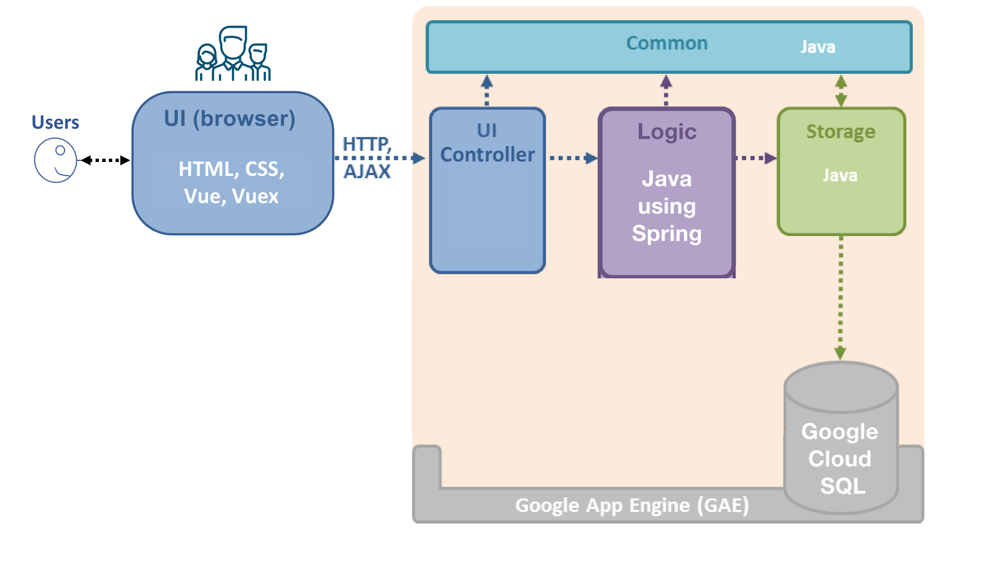

# Viz [](https://travis-ci.com/CS3219-SEM1/chairvise-project-2018-team-01)

## Overview
This project is a tool to analyze paper submission information for conferences. It is basically a visualization tool combined with a backend query service.
##### Technology stack
- Frontend: Vue.js + Vue Router + Vuex
- Backend: Google App Engine as PaaS + Spring REST + Google Cloud SQL (MySQL 5.6)

## Getting Started
To get started, you should have installed the latest version of IntelliJ on your local machine. Then please follow the steps.

- Environment setup
  - Config your IntelliJ. Please install the following plug-ins:
    - Google Cloud Tools 
    - Vue.js (optional)
  - Config your Google Cloud SDK. You can follow the instructions [here](https://cloud.google.com/sdk/)
  - Prepare for app engine deployment under project root directory
    ```
    $ gcloud -q components install app-engine-java
    ```
  - Config cloud SQL proxy. Please follow the instructions [here](https://cloud.google.com/sql/docs/mysql/connect-admin-proxy)
  - Install `npm`. We suggest using `NVM`, which stands for Node Version Manager. You can follow instructions [here](https://www.npmjs.com/get-npm)
  - Install sequel-pro from [here](https://www.sequelpro.com/) (optional)
- Configuration setup (optional). By default there are pre-set configurations for the project. However, if you may wish to change them, you can edit the following files:
  - `src/main/resources/application-local.properties` for SQL server connection setup (just in case the test SQL server have some changes).
- Run your application locally
  - Inside IntelliJ you can select run configuration as __Google App Engine Standard Local Server__.
  - Click `run` button (a green arrow) to run the application.
  - Access the application through [localhost](http://localhost:8080/web/home)

## Test and Deploy

### Test
Here are two main components in this project's testing stage; front-end testing and backend testing.
__IMPORTANT__: Please make sure that all tests pass before pushing your code.

- Frontend tests:
  - Make sure that `npm` is properly installed
  - Run the following commands under root directory.
    ```
    $ cd src/web/app
    $ npm install
    $ npm run test:unit
    ```
- Backend tests:
  - Run the following commands under root directory.
    ```
    $ ./gradlew check
    ```

### Deploy
You have two ways of deploying: locally and through continuous deployment.

- Local deployment:
  - Make sure that `npm` is properly installed on your local machine. You can verify it by calling
    ```
    $ npm -v
    ```
  - Make sure that Google Cloud SDK is properly installed on your local machine. You can verify it by calling
    ```
    $ gcloud --version
    ```
  - Authorize your Google Cloud SDK locally through
    ```
    $ gcloud auth login
    ```
  - Copy `application-prod.properties.template` under `/deploy` to `src/main/resources/`.
  - Name the file as `application-prod.properties`.
  - Modify the template with corresponding information.
  - Move to frond-end directory and build front-end code
    ```
    $ cd src/web/app
    $ npm install
    $ npm run build
    ```
  - Go to project root directory and run
    ```
    $ ./gradlew appengineDeploy
    ```
  Note that please do not commit `application-prod.properties` to Github.

- Continuous deployment:
Every time when `master` branch is updated, the new stable version will be automatically deployed to Google Cloud. 

## Website Design

### Architecture


Viz is a Web application that runs on Google App Engine (GAE). Given above is an overview of the main components.

- **UI**: The UI seen by users consists of Web pages containing HTML, CSS (for styling) and JavaScript (for client-side interactions). It is generated using Vue through direct rendering of data straight to DOM. Vuex is used as a state management pattern to ensure data can only be mutated in a predictable state.
- **Logic**: The main logic of the application is in Java with Spring framework.
- **Storage**: The storage layer of the application uses the persistence framework provided by **Google App Engine PaaS**, using Google Cloud SQL, MySQL 5.6.
- **Common**: The Common component contains utility code (data transfer objects, helper classes, etc.) used across the application.

The diagram below shows how the code in each component is organized into packages and the dependencies between them.


### UI Component

The UI component is the firs stop for all requests received by the web application. Such a request will go through the following steps:


1. Request `Controller` to forward a request
1. `BaseRestController` executes the action
1. It checks the access rights of the user and interact with the `Logic` component as necessary.
1. The Vue component uses the data and logic inside to generate teh HTML pages.
1. The response will then be sent back to the browser to be rendered.  

### Logic Component

The `Logic` component handles the business logic. In particular, it is responsible for:
- Managing relationships between entities, e.g. cascade logic for create/update/delete.
- Managing transactions, e.g. ensuring atomicity of a transaction.
- Providing a mechanism for checking access control rights.

### Storage Component

The `Storage` component performs CRUD (Create, Read, Update, Delete) operations on data entities individually.
It contains minimal logic beyond what is directly relevant to CRUD operations.

### Common Component

The Common component basically contains common utilities used across the web application. 
Package overview:
- **`common.util`**: Contains utility classes.
- **`common.exceptions`**: Contains custom exceptions.
- **`common.datatransfer`**: Contains data transfer objects.