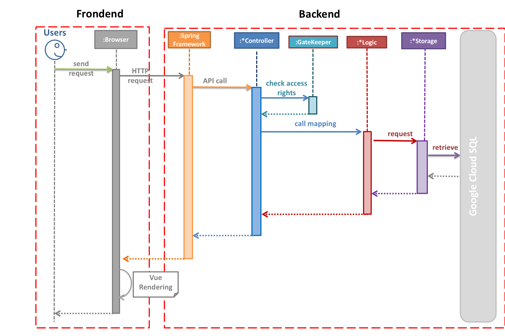
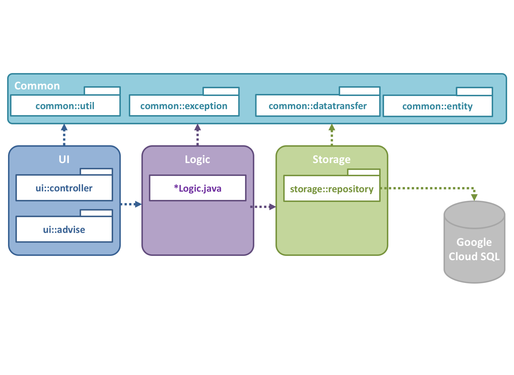
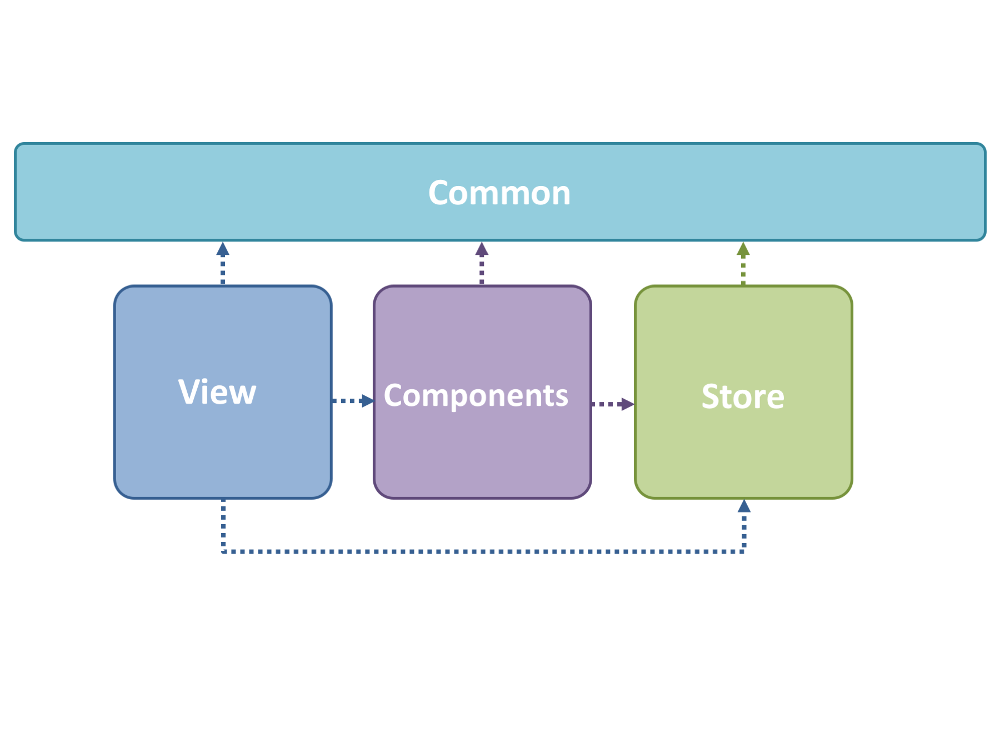
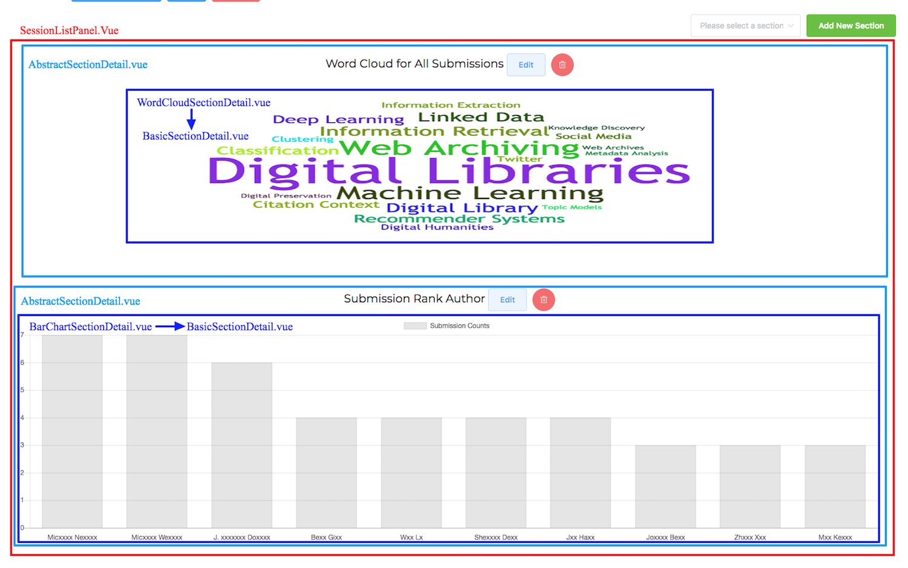

## Website Design

### Architecture

Viz is a Web application that runs on Google App Engine (GAE). Given above is an overview of the main components.

- **UI**: The UI seen by users consists of Web pages containing HTML, CSS (for styling) and JavaScript (for client-side interactions). It is generated using Vue through direct rendering of data straight to DOM. Vuex is used as a state management pattern to ensure data can only be mutated in a predictable state.
- **Logic**: The main logic of the application is in Java using the Spring framework.
- **Storage**: The storage layer of the application uses the persistence framework provided by **Google App Engine PaaS**, using Google Cloud SQL, MySQL 5.6.
- **Common**: The Common component contains utility code (data transfer objects, helper classes, etc.) used across the application.

### Typical Sequence Diagram
The diagram below showcases the workflow in the system of a typical request from the user.

1. Users will send a request to the browser for certain data or visualisation.
1. `Browser` sends a HTTP request to the backend, specifically Java which uses the Spring framework.
1. `*Spring` executes an API call to request controller to forward a request.  
1. `*Controller` checks the access rights of the user and executes the call by interacting with the `Logic` component
1. `*Logic` requests the data from the storage component.
1. `*Storage` retrieves the data from Google Cloud SQL.  
1. The response will be sent back to the browser where it will use Vue to render the web page.

### Backend Packages
The diagram below showcases the backend package overview of the existing system.

#### UI Component

The UI component is the first stop for all requests received by the web application. Such a request will go through different stages:
- **`UI.controller.api`**: Provide backend API access to the users.
- **`UI.controller.data`**: Helper object to send requests to the server.
- **`UI.controller.webpage`**: Handle static file requests for the users. 
- **`UI.advice`**: Handle exception calls by the application.

#### Logic Component

The `Logic` component handles the business logic. In particular, it is responsible for:
- Managing relationships between entities, e.g. cascade logic for create/update/delete.
- Providing a mechanism for checking access control rights.

#### Storage Component

The `Storage` component performs CRUD (Create, Read, Update, Delete) operations on data entities individually.
It contains minimal logic beyond what is directly relevant to CRUD operations.

#### Common Component

The Common component basically contains common utilities used across the web application. 
Package overview:
- **`common.util`**: Contains utility classes.
- **`common.exceptions`**: Contains custom exceptions.
- **`common.datatransfer`**: Contains data transfer objects.
- **`common.entity`**: Contains entity of the user for checking access right.

### Frontend Packages
The diagram below showcases the frontend package overview of the existing system.

- **`view`**: The view is mainly in charge of displaying pages of the application.
- **`component`**: The component contains reusable UI and display logic components which is called by multiple files.
- **`store`**: The store contains core logic of the application. It shows the state of the application and handles mutation and action to interact within the application.
- **`common`**: The common is mainly used to provide constants calls by other users.

### Frontend Component Usage
The diagram below showcases an existing usage of the front end packages in the web application.

